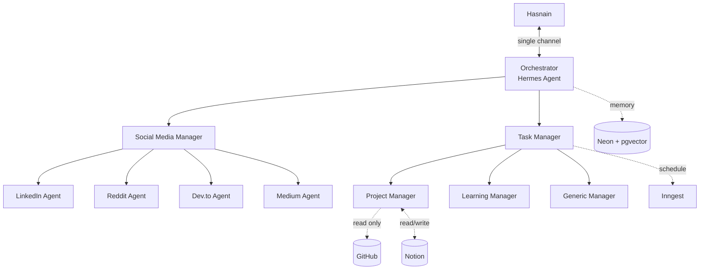
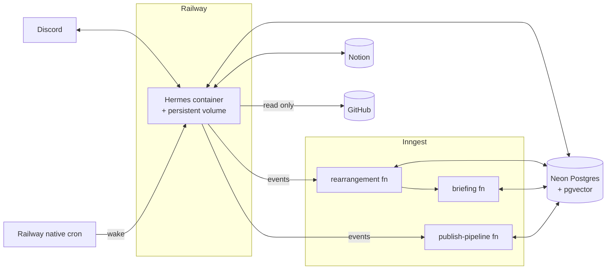
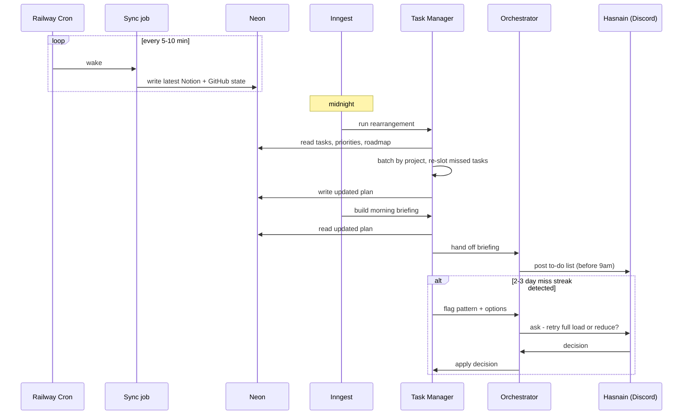
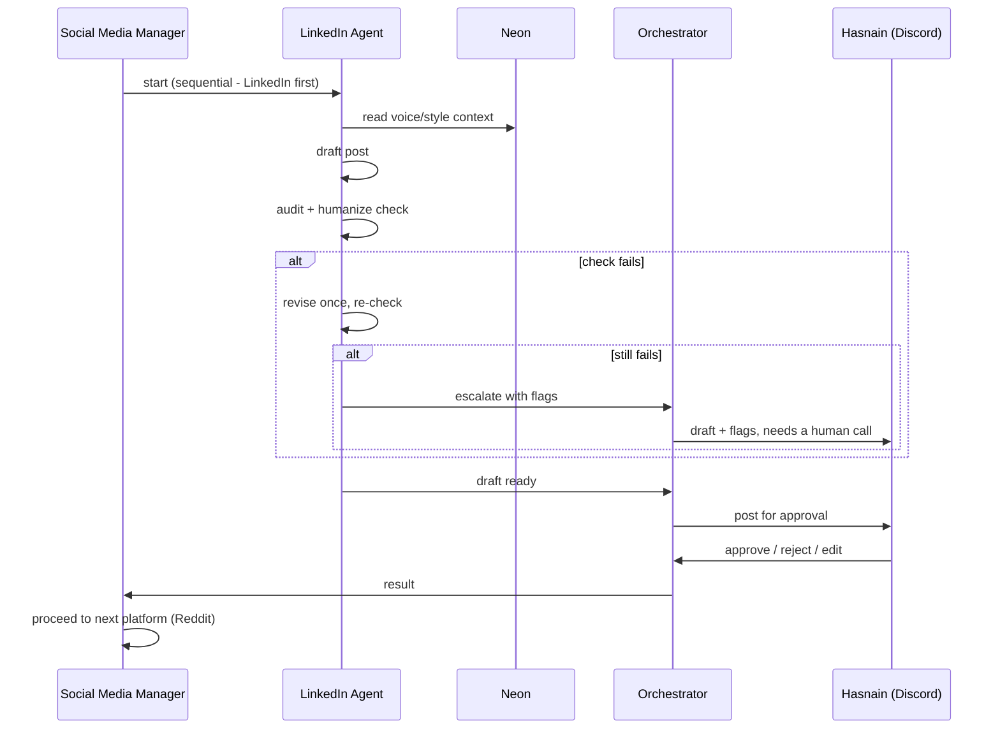
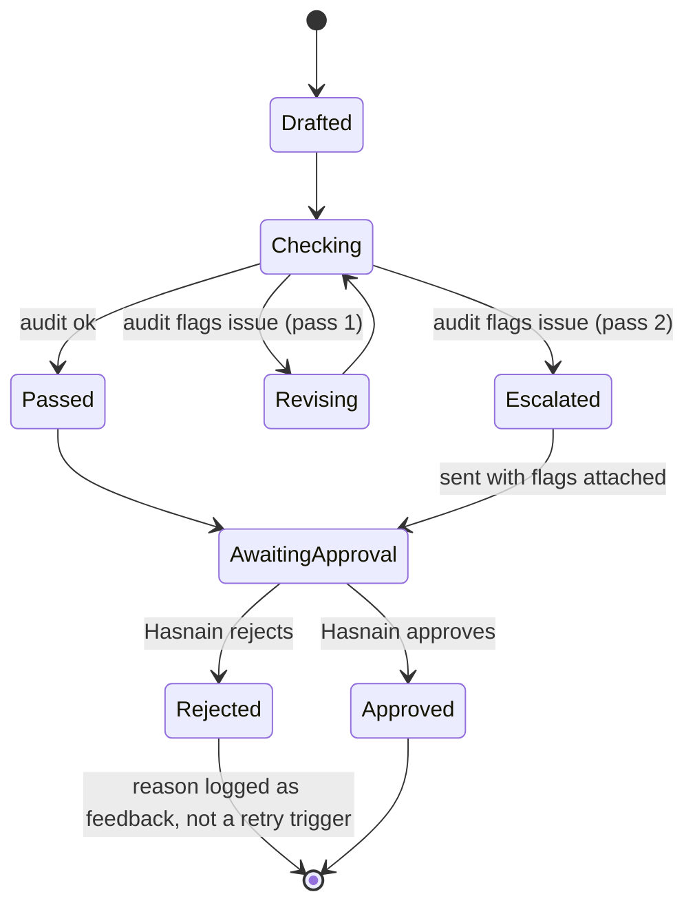

# Personal AI Assistant — Architecture Document

Sep 27, 2026 · @Hasnain

## System Overview

One Hermes Agent process, three levels of delegation, one human contact point (Discord), and one shared memory store (Neon). External systems are read from, never written to except where explicitly noted.

The orchestrator is the only component with a human-facing surface. Every manager and leaf agent is reachable only through it — there is no path for Hasnain to message a sub-agent directly, and no path for a sub-agent to message Hasnain except by routing through the orchestrator's Discord channel.

## Deployment Topology

One Railway service runs the Hermes container with a persistent volume (sessions, skill state, config survive restarts). Neon is external to Railway — connected by connection string, not a Railway add-on. Railway's native cron handles simple wake-up triggers (the 5–10 min Notion/GitHub poll); Inngest handles the three jobs that need retries and step-level observability (rearrangement, briefing generation, the multi-platform publish pipeline). Inngest functions call back into the same Hermes process rather than duplicating agent logic outside it.

## Data Flow: Daily Operating Loop

## Data Flow: Content Approval

Hasnain publishes manually for now (LinkedIn, Reddit, dev.to, Medium publishing tools are backlogged per the PRD) — this flow ends at approval, not at publish. The link/draft is what reaches Discord; the actual post is his click.

## State Machine: Validation & Bounded Retry

The hard rule that prevents an infinite loop: **Checking can only route to Revising once.** The second flag always routes to Escalated, never back to Revising. This caps every draft at exactly two automated passes before a human sees it, independent of how many issues the audit step finds.

## Data Model (Neon)

| Table | Key columns | Written by | Read by |
| --- | --- | --- | --- |
| `agents` | agent\_id, role, status | Orchestrator (bootstrap only) | All |
| `memory_chunks` | agent\_id (scope), content, embedding (pgvector) | Each leaf agent, on its own scope | All (similarity search), scoped by agent\_id so context doesn't bleed |
| `tasks` | task\_id, project\_id, notion\_id, github\_issue\_id (nullable), status, priority, due\_date | Sync job (from Notion/GitHub reads), rearrangement job | Task Manager, Project Manager |
| `projects` | project\_id, name, priority\_tier, roadmap\_ref | Sync job (from Notion) | Task Manager, rearrangement logic |
| `learning_tracks` | track\_id, name, priority\_tier, milestone\_state | Sync job, Learning Manager | Learning Manager |
| `drafts` | draft\_id, platform, content, state (matches the state machine), flags | Social Media leaf agents | Social Media Manager, Orchestrator |
| `miss_log` | date, tasks\_missed, consecutive\_count | Rearrangement job | Task Manager, Learning Manager (consecutive-miss detection) |
| `idea_dump` | idea\_id, description, status, overlap\_flag | Orchestrator (on intake) | Task Manager |

`memory_chunks.agent_id` scoping is the mechanism that keeps LinkedIn drafts, GitHub context, and learning notes from cross-contaminating in similarity search — every query filters on it before ranking by embedding distance.

## Component Responsibilities

| Component | Trigger | Reads | Writes | Never does |
| --- | --- | --- | --- | --- |
| Orchestrator | Discord message; scheduled hand-off from Task/Social Media Manager | Nothing directly — always via a manager | Discord channel | Draft content, decide task priority |
| Social Media Manager | Daily content window (Inngest) | `memory_chunks` (voice/style) | `drafts` | Publish without approval |
| LinkedIn / Reddit / Dev.to / Medium Agent | Called by Social Media Manager, one at a time | Platform-specific style context | Its own `drafts` row | Act out of sequence with its siblings |
| Task Manager | Sync poll, midnight rearrangement, briefing job | `tasks`, `projects`, `miss_log` | `tasks` (rearranged plan), `miss_log` | Create or assign GitHub issues |
| Project Manager | Called by Task Manager | GitHub (read-only), Notion | Notion (status/priority fields it owns) | Write to GitHub in any form |
| Learning Manager | Same cadence as Task Manager | `learning_tracks`, `miss_log` | `learning_tracks` | Auto-reduce workload without asking |
| Generic / Routine Manager | Ad hoc, on unstructured input | Nothing structured | Routes to Notion inbox or another agent | Attempt to classify beyond simple routing (v1 scope) |

## Security & Access Boundaries

| Boundary | Scope | Enforced by |
| --- | --- | --- |
| GitHub | Read-only, scoped repos only | Token scoped to read at the provider level, not just by convention — the credential itself cannot write |
| Notion | Read/write, but only the fields the agent owns (status, priority sync) | Notion integration permissions per database |
| Discord | One channel; Hasnain is the only authorized user the orchestrator acts on | Hermes access control config |
| Publishing (LinkedIn/Reddit/dev.to/Medium) | No credentials configured in v1 — backlogged | Not built, not a permission to revoke later |
| Neon | Single database, agent-scoped rows via `agent_id`, no cross-tenant concern since this is single-user | Application-level scoping, not row-level security (not needed at this scale) |
| Startup's Hermes instance | Fully separate deployment, separate Neon database, no shared credentials or memory | Physical separation, not a config flag |

The GitHub read-only boundary is the one worth being strict about at the infrastructure level rather than trusting the skill's prompt: the token itself should be a read-only PAT or a GitHub App installation scoped to `contents:read` and `issues:read`, so a bug in a skill can't accidentally write even if the skill's logic tries to.
