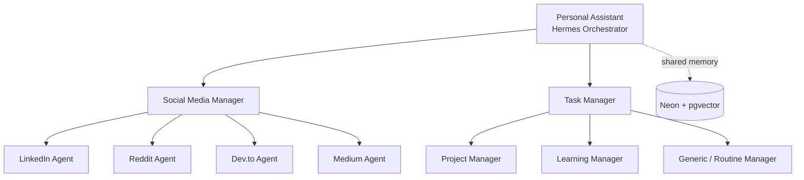

# Personal AI Assistant — Product Requirements Document

Sep 24, 2026 · @Hasnain

## Overview & Problem Statement

Hasnain runs a solo freelance dev practice plus an early-stage startup, and currently has no systematic way to produce content, manage tasks, or track learning goals without doing all of it manually. Ideas get captured as rambling voice notes (this PRD started as one) and lose momentum before they're built.

This project is a **personal multi-agent AI assistant**, built on Hermes Agent, that runs continuously in the background, handles social media content production and personal task/learning management, and asks for approval before anything goes out publicly.

It is a **separate deployment** from the startup's Hermes-based project-management bot (GitHub issue triage + Discord notifications for the two co-founders). Same underlying framework, different instance, different memory, different purpose. They should not share a Hermes process or a Neon database.

**Interaction model.** Hasnain talks to one Discord channel and one entity: the orchestrator. He never messages a leaf agent directly, and he never has to invoke a leaf agent's skill himself. The orchestrator relays instructions to whichever manager/agent is relevant and reports back through that same channel — daily accomplishment summaries, the morning briefing, and anything needing a decision. **Every approval request — a draft, an escalated flag, anything requiring a yes/no — surfaces in that one channel, from the orchestrator, never from a leaf agent directly.**

**Leaf-agent visibility channels (added 2026-09-29, post-Phase 1).** Each active leaf agent also gets its own dedicated Discord channel (e.g. `#linkedin-agent`) where the orchestrator narrates that agent's intermediate work — drafting, the audit pass, revisions — as it happens. This is **read-only observability for Hasnain, not a second interaction surface**: he can watch a leaf agent work in its channel, but he never needs to act there, and the leaf agent never asks him anything there. The approval gate always lives in the main channel. This came out of Phase 1 feedback: the original approval loop had Hasnain invoking a leaf agent's skill directly and approving in the same conversation, which defeated the single-point-of-contact design — see the Architecture Document's Channel Topology section for how this maps onto Hermes's actual primitives (one bot/profile, multiple channels, no separate bot token per leaf agent).

## Goals & Scope

**v1 goals**

- Draft and, after approval, publish content to LinkedIn, Reddit, dev.to, and Medium in Hasnain's voice
- Read GitHub issues and Notion tasks (both logged manually by Hasnain) to keep Task Manager's context current — no issue creation or assignment
- Track learning goals with milestones and nudge when progress stalls
- Capture unstructured input (text or voice, via Discord/Telegram) and route it to the right agent
- Every public action (a post, a comment, a reply) requires human approval via Discord before it goes out
- Shared memory (Neon + pgvector) so any agent can pull relevant context about Hasnain's voice, past posts, and active projects
- Daily morning briefing: a draft timetable/to-do list ready before the day starts, built from active projects, the 90-day roadmap, and Notion priority
- Automatic rearrangement of missed or unfinished tasks — nothing to manually reshuffle each morning
- Single Discord channel, single point of contact — Hasnain talks only to the orchestrator; it relays to and reports back from every sub-agent

**Explicit non-goals for v1**

- No autonomous publishing without approval, ever — this is a hard constraint, not a v1 shortcut
- No merge with the startup's Hermes PM instance
- No Instagram, X/Twitter, or TikTok agents yet — LinkedIn, Reddit, dev.to, Medium only
- No custom UI/dashboard beyond Hermes's own web dashboard and Discord — a Next.js frontend is a v2 idea, not a launch requirement
- No fully autonomous "Generic / Routine Manager" logic — v1 ships it as a simple intake-and-route skill, not a smart agent
- No GitHub write access of any kind — the agent never creates, labels, comments on, or assigns issues; Hasnain owns that entirely
- No silent workload reduction — on a multi-day miss streak, the agent proposes options in Discord and waits for Hasnain to decide

## Architecture

Three levels: one orchestrator, two managers, seven leaf agents. Every arrow is a delegation, not a hard API call — the manager decides which leaf agent handles a request.



**Orchestrator (Hermes Agent)** — holds the conversation surface (Discord), routes incoming requests to Social Media Manager or Task Manager, and is the only layer with direct human contact. It does not draft content itself.

**Social Media Manager** — routes by platform to its four leaf agents. Owns the shared voice/style context (post history, tone) that all four leaves read from Neon before drafting.

**Task Manager** — routes by domain to Project Manager, Learning Manager, or Generic/Routine Manager. Owns the Notion schema sync so all three leaves see the same task/project state.

**Leaf agents** — each is a Hermes persona (system prompt + scoped skills + scoped tools), not a separate process. All seven read/write the same Neon memory, scoped by agent-id so context doesn't bleed between, e.g., LinkedIn drafts and GitHub triage notes.

**Approval gate** — every leaf agent that produces public output (the four Social Media Manager leaves) stops before publishing and sends the draft to Discord for a thumbs up/down. Task Manager leaves act more autonomously (issue assignment, nudges) since nothing they do is public-facing, but still notify via Discord.

**Processing order.** Social Media Manager runs its four leaf agents sequentially, not in parallel — one platform's draft clears review before the next starts. See Validation & Feedback Loop below for what "clears review" means and how retries are bounded.

## Agents & Skills

### LinkedIn Agent

| Skill | Function | Source |
| --- | --- | --- |
| linkedin-post-writer | Drafts posts using 10 proven 2026 hook formulas | [sergebulaev/linkedin-skills](https://github.com/sergebulaev/linkedin-skills) |
| linkedin-humanizer | Strips AI tells, runs 5 AI-detector checks pre-publish | same repo |
| linkedin-comment-drafter | Drafts comments on a given post URL in Hasnain's voice | same repo |
| linkedin-content-planner | Generates a 7-day content plan from theme/audience/pillars | same repo |
| linkedin-profile-optimizer | Audits/rewrites profile for inbound leads | same repo |
| linkedin-engager-analytics | Segments who's engaging with posts | same repo |

### Reddit Agent

| Skill | Function | Source |
| --- | --- | --- |
| reddit-poster | Discover → draft → dry-run → approve flow, proper flair handling | [cskwork/reddit-skill](https://github.com/cskwork/reddit-skill) |
| reddit-insights | Semantic search across Reddit for pain points / idea validation | [BrianRWagner/ai-marketing-claude-code-skills](https://github.com/BrianRWagner/ai-marketing-claude-code-skills) (`reddit-insights/SKILL.md`) |

### Dev.to Agent

| Skill/Tool | Function | Source |
| --- | --- | --- |
| publish-devto | GitHub Action — publishes markdown to dev.to via API | [cloudx-labs/publish-devto](https://github.com/cloudx-labs/publish-devto) |
| devto-cli | Same publishing as a CLI the agent can call directly | [rnag/devto-cli](https://github.com/rnag/devto-cli) |

No dedicated dev.to "voice" skill exists — reuses LinkedIn Agent's content-planner output, reformatted.

### Medium Agent

| Skill/Tool | Function | Source |
| --- | --- | --- |
| post-to-medium-action | GitHub Action, publishes via Medium's API | [philips-software/post-to-medium-action](https://github.com/philips-software/post-to-medium-action) |
| publish-all | One markdown file → converted + published across multiple platforms, extensible per-platform converter | [iPythoning/publish-all](https://github.com/iPythoning/publish-all) |

### Project Manager

| Skill | Function | Source |
| --- | --- | --- |
| triage-issue (read-only mode) | Classifies and prioritizes open issues for Hasnain's awareness — never writes labels, comments, or assignments | [warpdotdev/oz-for-oss](https://github.com/warpdotdev/oz-for-oss/blob/main/.agents/skills/triage-issue/SKILL.md), tool permissions scoped to read |
| spec-to-implementation | Converts a spec into an implementation plan with task tracking | [tommy-ca/notion-skills](https://github.com/tommy-ca/notion-skills) |
| notion-cli | Reads/writes Notion data sources the agent owns (status, priority) — never GitHub | [CaesiumY/notion-cli-skill](https://github.com/CaesiumY/notion-cli-skill) |
| roadmap-sync (custom) | Polls Notion + GitHub every 5–10 min for changes; matches new/updated items against the 90-day roadmap and project priority | build in-house — no repo fits Hasnain's specific schema |

`context-switch-guard` has no real repo match — build it as a short custom skill.

### Learning Manager

| Skill | Function | Source |
| --- | --- | --- |
| goal-tracker | Milestones, daily logging, weekly summary, HTML dashboard, nudges after 3+ days without progress (the alerting system) | [bighardperson/computer-science-skills-collection](https://github.com/bighardperson/computer-science-skills-collection) |
| last30days | Researches a topic across Reddit/X/web from the last 30 days, for resource curation | [BrianRWagner/ai-marketing-claude-code-skills](https://github.com/BrianRWagner/ai-marketing-claude-code-skills) (`last30days/SKILL.md`) |

### Generic / Routine Manager

No off-the-shelf skill fits — this is inherently Hasnain-specific. v1 ships one thin custom skill: take unstructured input (text or voice) and route it to the right agent or Notion inbox. Deliberately the smallest, dumbest skill in the system.

## Tech Stack

| Layer | Choice | Why |
| --- | --- | --- |
| Agent runtime | Hermes Agent (Python) | Self-improving skill system, native Discord gateway, MCP support, cron built in |
| Multi-agent orchestration | oh-my-hermes primitives | Delegation pattern built specifically for Hermes, no second framework needed |
| Database / memory | Neon Postgres + pgvector | Serverless Postgres, native vector extension, one DB for structured + embedded data |
| Messaging / approval | Discord (native Hermes gateway) | No custom bot to build or maintain |
| Task source of truth | Notion (existing schema) | Already in use; agents read/write via Notion CLI + MCP |
| Code source of truth | GitHub (scoped repos) | Issue triage via `gh` CLI-based skills |
| Web research | Search API (Tavily or Brave) + Firecrawl for scraping | Avoids building/maintaining a crawler |
| Screenshots | Playwright (headless) | For npm/GitHub release screenshots the Social Media Manager needs |
| Scheduling | Railway native Cron Jobs (simple periodic triggers) + Inngest (Python SDK, for anything needing retries/observability) | See Infrastructure section for the split |
| Hosting | Railway | Official Hermes deployment templates exist; see next section |
| Skill governance (later) | skill-tracker | Git-backed PR review once self-modifying skills accumulate |
| Publishing (backlogged) | Postiz or Free-AI-Social-Media-Scheduler | Deferred — manual posting for now per Hasnain's call |

## Infrastructure & Deployment

**Can this run on Railway? Yes, and it's a well-trodden path.** Nous Research's Hermes Agent has multiple official and community Railway templates (Docker-based, with a persistent volume so sessions/memory/skills survive restarts, Discord/Telegram/Slack support built in, and an optional web dashboard behind login). This is not a workaround — Railway is a documented, supported host for exactly this workload: a single long-lived Python gateway process.

Practical setup: one Railway service running the Hermes container with a persistent volume, `DISCORD_BOT_TOKEN` and provider API keys as environment variables, and Neon as an external managed Postgres (Neon isn't a Railway add-on, but connecting an external Postgres from a Railway service is standard — just a connection string).

**Cron: Railway native cron vs. Inngest — use both, for different jobs.**

Railway has shipped native Cron Jobs since 2023 (Settings → Cron on any service) — it runs your container on a schedule and shows execution history. This is fine for simple periodic wake-ups: "run the Learning Manager's goal-tracker check every morning," "pull new GitHub issues every hour." No extra service, no extra cost.

Inngest is a different tool, not a cron replacement: it's a durable, event-driven job platform with automatic retries, per-step checkpointing, and a dashboard showing exactly which step of which run failed and why. It has a Python SDK. The distinction that matters here: Railway cron re-runs your whole container/script on a timer with no retry logic — if step 3 of 5 fails, the whole thing either silently fails or reruns everything from scratch next cycle. Inngest checkpoints each step, retries only the failed step, and gives you a UI to see what happened.

**Recommendation:** Railway native cron for the trivial wake-up triggers (checking for new issues, daily digest kickoff). Inngest for anything with real failure modes worth seeing — the issue-triage pipeline (fetch → classify → assign → notify), the multi-platform publish flow (draft → approve → publish to 4 possible platforms), the goal-tracker nudge logic. Free tier covers this project's volume comfortably; paid tiers start around $20/month only if usage grows well past personal-assistant scale.

## Repo & Project Structure

**Naming.** `righthand-agent` — settled. Distinct from the startup's Hermes PM repo naming pattern (no shared prefix/suffix), and reads clearly as "the thing that acts on Hasnain's behalf," which matches the single-point-of-contact architecture below: everything routes through one orchestrator, nothing is a peer.

**Structure**, following the Control Room pattern from hermes-agent-control-room so new leaf agents can be added without touching orchestrator code:

```
righthand-agent/
├── src/
│   ├── control-room/           # governance sidecar — agent registry, runbooks
│   │   ├── agents/             # one file per agent: role, skills, tools, status
│   │   └── runbooks/
│   ├── orchestrator/            # Hermes config, routing rules, Discord gateway config
│   ├── agents/
│   │   ├── social-media-manager/
│   │   │   ├── linkedin/skills/
│   │   │   ├── reddit/skills/
│   │   │   ├── devto/skills/
│   │   │   └── medium/skills/
│   │   └── task-manager/
│   │       ├── project-manager/skills/
│   │       ├── learning-manager/skills/
│   │       └── generic-manager/skills/
│   ├── memory/                  # Neon schema, migrations, pgvector setup
│   └── inngest/                 # durable job functions
├── railway.json                 # cron + service config
└── .env.example
```

## Daily & Weekly Operating Loop

| Job | Cadence | Runs via |
| --- | --- | --- |
| Notion + GitHub sync (read-only) | Every 5–10 min | Railway native cron |
| Task/learning rearrangement pass | Midnight (server idle) | Inngest (needs retry/step logic — see Validation section) |
| Morning briefing generation | Before 9am, after the midnight rearrangement pass | Inngest |
| Morning briefing delivery to Discord | \~8am (before content windows start) | Triggered by the above |
| LinkedIn draft ready | 9–11am window | Inngest |
| Reddit threads/comments surfaced (links, not auto-posted) | 9–11am window | Inngest |
| Dev.to publish window | Time TBD — see Open Questions | Inngest |
| Medium publish window | Time TBD — see Open Questions | Inngest |
| Weekly full resync (new issues Hasnain logged over the week) | Sunday | Inngest |

The midnight pass and the morning generation are two separate jobs, not one — rearrangement needs to finish and settle before the briefing is built off it, and separating them means a slow rearrangement run never delays the briefing past its deadline (the briefing runs off whatever rearrangement produced, even if that run is still finishing edge cases).

## Task & Learning Rearrangement Logic

This is the core behavior that makes Task Manager and Learning Manager more than loggers — they actively replan, not just track.

**Priority signal.** Hasnain tags each project/track in Notion with a priority (e.g. SaaS product > portfolio product). The rearrangement pass reads this before touching anything.

**Project batching.** When multiple projects are active, the scheduler favors consecutive work on the same project over daily context-switching — if Hasnain worked on Project A yesterday, today's plan keeps Project A's remaining tasks together rather than interleaving with Project B, unless Project B is higher-priority and time-sensitive.

**Missed-task rearrangement.** Every midnight, unfinished tasks from that day roll into the queue and get re-slotted into upcoming days by priority — not just pushed to tomorrow, which would just compound the backlog.

**Consecutive-miss detection.** If Hasnain misses his to-do list for 2–3 consecutive days, the agent does not silently reduce scope and does not just keep re-rearranging forever. It flags the pattern in the morning briefing and asks directly: try the full load again, or cut lower-priority items for now? Hasnain decides; the agent never auto-descopes.

**New idea intake.** When Hasnain mentions a new idea mid-conversation, the orchestrator checks whether it's already in the idea dump (Notion) before adding it — no duplicates — and tells him where it landed relative to current priorities, not whether to start it now.

**Learning Manager mirrors this exactly** — same priority field, same batching logic, same consecutive-miss check, applied to learning tracks (e.g. system design, interview prep) instead of projects.

## Validation & Feedback Loop

The failure mode to design against: a draft keeps getting kicked back to revision and never reaches Hasnain. Bounded retry fixes this.

1. Leaf agent produces a draft
2. Its skill's own audit/humanizer step checks it (e.g. linkedin-humanizer's AI-detector pass)
3. Fails → leaf agent revises once, re-checks
4. Fails again → **stop trying to self-fix.** Send the draft to Discord with the specific flags attached ("detector flagged this as AI-written, paragraph 2") and let Hasnain decide: fix it himself, tell the agent what to change, or approve as-is
5. Passes at any point → goes to Discord as a normal approval request (not a failure escalation)

Maximum two automated passes before it's a human's call, never more. This bound applies per platform, independently — a Reddit draft looping doesn't block LinkedIn's draft from proceeding, which is also why Social Media Manager processes leaf agents sequentially but each leaf agent's own retry loop is self-contained and doesn't stall the others waiting on it.

## Edge Cases

| Case | Handling |
| --- | --- |
| Notion and GitHub disagree on a task's status | GitHub is the source of truth for code state (merged PRs close issues); Notion is the source of truth for priority and planning. On conflict, flag it in the briefing rather than silently picking one |
| Two projects have equal priority and both are time-sensitive | Surface the conflict to Hasnain in the morning briefing instead of guessing — this is a judgment call, not a scheduling algorithm's job |
| Hasnain ignores the workload-reduction prompt entirely | Don't re-ask every day — ask once, note "pending Hasnain's call" in subsequent briefings until answered, don't nag |
| Midnight rearrangement job is still running when the morning briefing job starts | Briefing job waits on rearrangement's completion signal (Inngest step dependency) rather than racing it |
| A GitHub issue is logged in Notion but not yet reflected in a completed GitHub sync poll | 5–10 min polling means up to that lag; acceptable per Hasnain's own spec — no need for webhooks unless this becomes a real problem |
| Draft passes automated validation but Hasnain rejects it anyway in Discord | Not a validation failure — log the rejection reason as feedback the leaf agent's skill can reference next time, not as a retry trigger |
| New idea overlaps heavily with something already in the idea dump | Flag the overlap explicitly rather than silently merging or silently adding a duplicate — Hasnain decides if it's the same idea |
| Weekend/day-off — does rearrangement and briefing still run? | Not specified by Hasnain yet — flagged in Open Questions below rather than assumed |

## Rollout Plan

1. Railway deploy of bare Hermes, Discord-connected, Neon attached — nothing else
2. LinkedIn Agent only: install linkedin-skills, wire the Discord approval loop end-to-end
3. Run LinkedIn Agent unattended for a week before adding anything
4. Add Reddit Agent (reuses the same approval loop)
5. Add Project Manager (GitHub + Notion read-only sync) — independent of the social media branch, can run in parallel with step 4
6. Add Dev.to + Medium Agents (reuse publish-all pattern)
7. Add Learning Manager, then Generic/Routine Manager last, since it depends on the other six existing to route into

## Open Questions

- Exact time for the morning briefing and the per-platform content windows — drafted as briefing before 9am, content windows 9–11am, pending confirmation
- Voice-note ingestion into Generic/Routine Manager — in scope for v1 or v2?
- Exact Notion schema fields Project Manager needs to read/write — not yet documented, needed before build step 5
- Timezone for all cron jobs — assumed Asia/Karachi (PKT); confirm
- Does the daily briefing and rearrangement pass run on weekends/days off, or pause?
